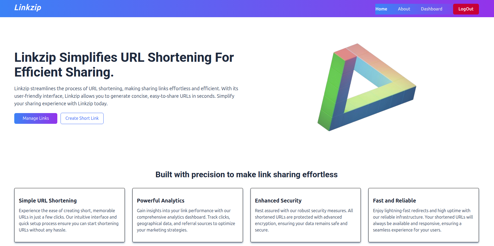
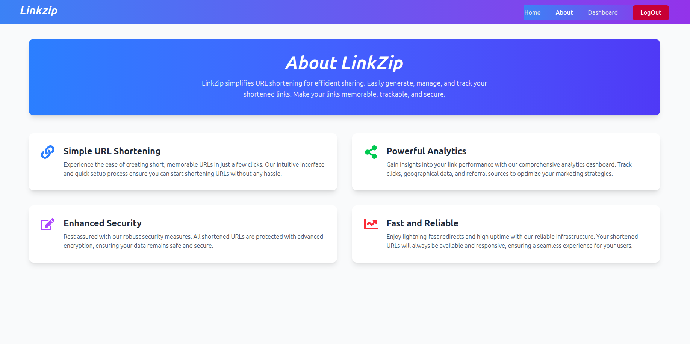
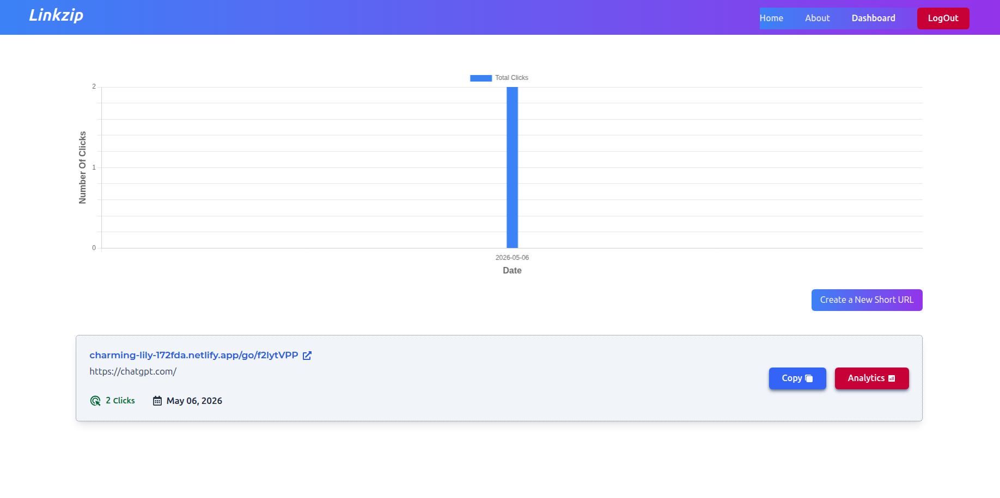
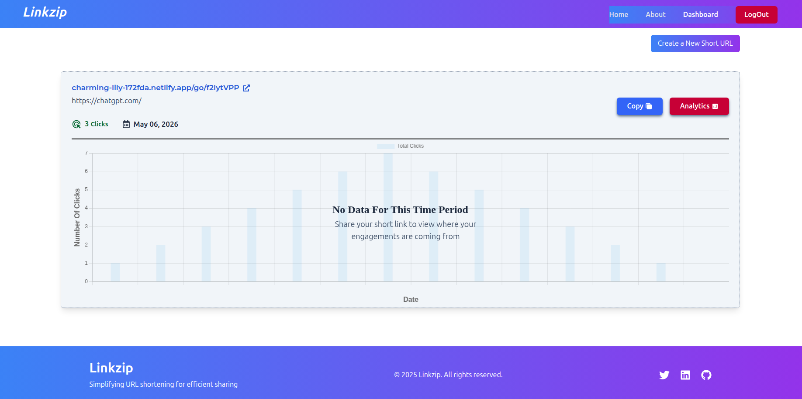
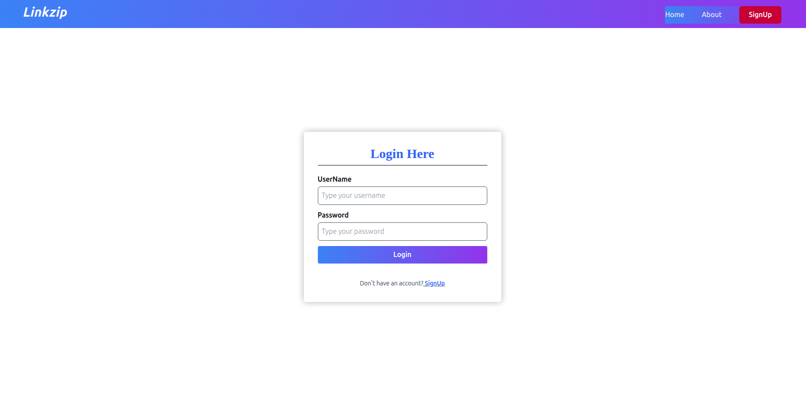
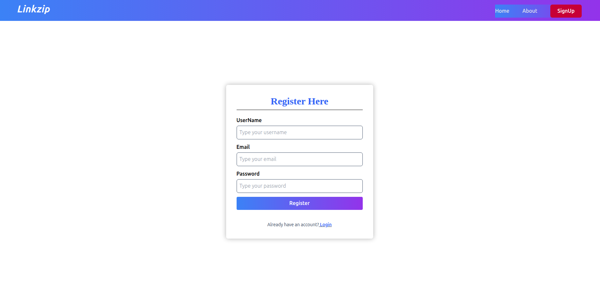

# Linkzip

### Project Link - https://charming-lily-172fda.netlify.app

## About the project

**LinkZip** simplifies URL shortening, making it fast, secure, and easy to manage. Key features include:

✂️ **Simple URL Shortening**  
  Create short, memorable URLs in just a few clicks. The intuitive interface and quick setup make link shortening effortless.

📊 **Powerful Analytics**  
  Gain insights into your link performance with a comprehensive analytics dashboard. Track clicks, geographic data, and referral sources to optimize your strategies.

 🔒 **Enhanced Security**  
  All shortened URLs are protected with advanced encryption, keeping your links and data safe from threats.

 ⚡ **Fast and Reliable**  
  Enjoy lightning-fast redirects and high uptime with our robust infrastructure. Your links are always available and responsive for a seamless user experience.

## 🎬 Demo

[Watch the demo on YouTube](https://youtu.be/AA5Ili0Q_xg)

## 📸 Screenshots

### Home Page

### URL Shortener

### Analytics Dashboard

### Link Details

### Login / Auth

### Mobile View

## 🛠️ Built With

This project uses the following major frameworks and libraries:

* 
* 
* 
* 
* 
* 
* 
* 
* 
* 
* 
* 
* 
* 
* 
* 
* 

---

## 📫 Connect with Me

  

---

